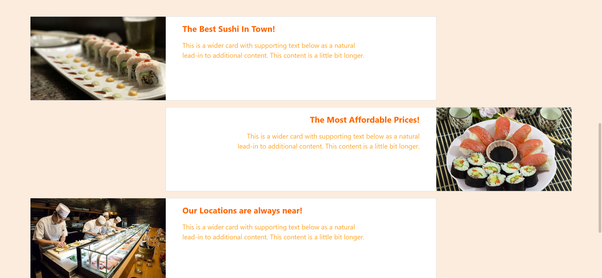
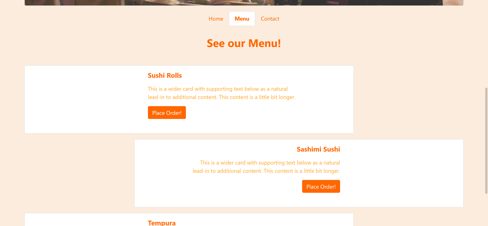
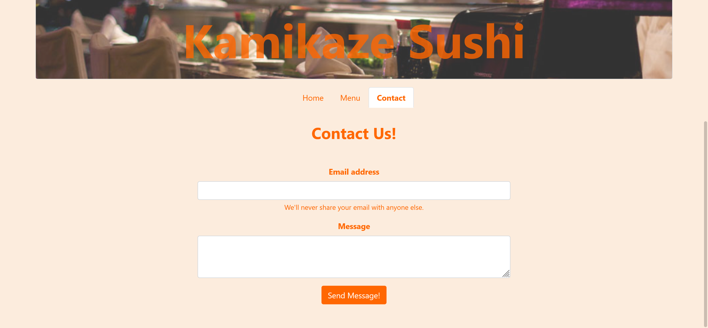

# Javascript Restaurant Page

> This is a mockup restaurant page build with ES6 and Webpack, Sass used for custom styles and bootstrap 5 was used for custom utilities. Webpack image and styles loaders for compressed images and minimized css.

# Application Screenshot





## Built With

- HTML
- CSS
- Sass
- Bootstrap 5  
- ES6
- Webpack

## Live Demo

You can visit [here](https://gabrieljsuarez.github.io/JS-restaurant-page/) our app.

## Getting Started

To get a local copy up and running follow these simple example steps:

- Clone this repository with:
```
   https://github.com/GabrielJSuarez/JS-restaurant-page.git
```
- Install Dependencies on package.json:
```
   $ npm install
```
- Build project from script declared in package.json:
```
   $ npm run build
```
- Launch live server visualizer:
```
   $ npm start
```

## Prerequisites

- Web Browser
- Internet connection
- Node.js
- npm

## Authors

👤 **Gabriel Suarez**
- Github: [@ginnandjuice](https://github.com/ginnandjuice)
- Twitter: [@fatbaxxter](https://twitter.com/fatbaxxter)
- Linkedin: [Gabriel Suárez](https://www.linkedin.com/in/gabriel-ginn-suarez/)


## 🤝 Contributing

Contributions, issues, and feature requests are welcome!

## Show your support

Give a ⭐️ if you like this project!

## 📝 License

This project is [MIT](https://github.com/GabrielJSuarez/JS-library/blob/development/LICENSE.txt) licensed.
